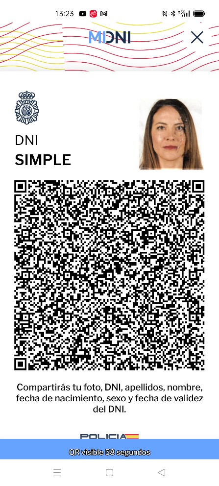

## Ejemplo decodificación

## Imagen QR

A continuación, se muestra una imagen de ejemplo, que se va a decodificar.



## Datos del QR

Al leer este QR, los datos obtenidos serán:

> Volcado hex separado: `code/fixtures/qr_dump_01.txt`

### Cabecera

Los primeros 38 bytes constituyen la cabecera del sello definida en el documento de ICAO:

> Volcado hex separado: `code/fixtures/qr_dump_02.txt`

Que se interpretan de la siguiente forma:

| Valor | Tamaño | Descripción |
| --- | --- | --- |
| DC | 1 | ‘Magic Constant’. |
| 03 | 1 | Versión del formato utilizado. Siempre será el valor 0x03, que indica que es la versión 4. Se utiliza esta versión por ser la más actual, y que permite datos de tamaño superior a 254 bytes. |
| 7581 | 2 | País expedidor, codificado en C40. Siempre tendrá el valor ‘ES’. <br>C40decode(‘7581’) → “ES” |
| 759ea9b5 <br> <br>267c3411 <br>4bf91b66 2d5d785a 71f94bb4 <br>72ec71f9 <br>71c1 | v | Identificador del firmante, y referencia del certificado, en formato C40. <br> <br>Decodificando los 4 primeros bytes: <br>C40decode(‘759ea9b5’) → “ESPN20” <br> <br>El 20 final indica que la referencia del certificado tiene 32 (0x20) bytes, y para codificar 32 bytes en C40 se necesitan 22 bytes ((32+2)/3)*2 en aritmética entera. <br> <br>y decodificando los 22 siguiente bytes: <br>C40decode(‘267c...71c1’)→ “2274948240B9368F65E5C80FEBFE5CE4” <br> <br>Resultando: <br>Pais → ES. <br>Entidad firmante en el país → PN. <br>Tamaño de la referencia del certificado → .32 (0x20) bytes una vez decodificados C40, 22 bytes antes de decodificar <br>Referencia el certificado de firma → 2274948240B9368F65E5C80FEBFE5CE4. |
| 3fa8f8 | 3 | Fecha de emisión del documento: Wed Apr 17 00:00:00 GMT+02:00 2024 |
| 3fa8f8 | 3 | Fecha de firma de los datos: Wed Apr 17 00:00:00 GMT+02:00 2024 |
| 07 | 1 | Referencia a la definición de los elementos del documento:  <br>	 	7: Verificación simple |
| 09 | 1 | Categoría de tipo de documento:  	9: DNI en el móvil de España |


### Cuerpo del QR

El cuerpo del QR está formado por los campos en formato TLV de los datos incluidos en el

QR seleccionado.

En el volcado mostrado anteriormente, las etiquetas de los TLV se muestran en negrita, y las longitudes en negrita cursiva.

Los datos obtenidos en este ejemplo concreto son:

nDocumento         0x40 (  9) - 99999999R                    - 393939393939393952 fNacimiento        0x42 ( 10) - 01-01-1980                   - 30312D30312D31393830 Nombre             0x44 (  6) - CARMEN                       - 4341524D454E

Apellidos          0x46 ( 19) - ESPA..OLA ESPA..OLA          - 45535041C3...C3914F4C41 Sexo               0x48 (  1) - M                            - 4D

fCaducidad         0x4c ( 10) - 17-04-2034                   - 31372D30342D32303334 imagenMini         0x50 (892) - ....jP  .........._@...      - 0000000C6A...5F4080FFD9 Caducidad BiDi     0x80 ( 19) - 17-04-2024 11:28:20          - 31372D3034...32383A3230

Todas las fechas/horas están en UTC.

### Firma de datos

El último dato incluido es la firma de los datos, añadida como un TLV más con etiqueta 0xff:

SIGNATURE            255 ( 64) – 9881E4DA3427F7F8F0C4BB2E04514E46F97398AEF2734235BAAC261627609FC0

EC0F3B591D592AAE5B40D85749C8768EF9B183AA1CBF7561C1C0E22B423EB660

Para verificar la firma, lo primero es obtener el certificado utilizado para la firma, y que se puede identificar a partir de la referencia incluida en la cabecera del sello:

“2274948240B9368F65E5C80FEBFE5CE4”.

Cabe señalar que las firmas de miDNI tienen una validez limitada, al estar diseñadas para ser verificadas en el momento y caducar a los pocos minutos. La verificación de la firma y la caducidad de los datos de miDNI aseguran la autenticidad y validez de los datos únicamente en el momento de su verificación.

Los datos a firmar son todo el contenido del QR, excepto el TLV de la firma al final de los datos.

En el ejemplo, es todo el contenido desde la posición 0 a la posición 0x3fe, dónde empieza firma.

Datos a firmar  “dc03758175 … 313a32383a3230”

Por último, la firma es el contenido del último TLV, con etiqueta 0xff:

Firma  “9881E4DA3427F7F8F0C4BB2E04514E46F97398AEF2734235BAAC261627609FC0

EC0F3B591D592AAE5B40D85749C8768EF9B183AA1CBF7561C1C0E22B423EB660”

Con estos tres datos (certificado firmante, datos firmados, y firma), ya podemos verificar la firma.

En este ejemplo la firma está realizada con ECDSA, y en el sello solo se incluyen los dos componentes (r y s) de la firma, sin la estructura ASN1 que algunas librerías de verificación esperan como entrada.

El siguiente ejemplo en java muestra cómo realizar la verificación de este ejemplo, incluyendo la construcción del ASN1 que espera la librería de verificación:

public static void main(String[] args) {     try {

//

// Certificado de firma

```java
// 
        String signerPemCert = 
            "MIIIPDCCBiSgAwIBAgIQInSUgkC5No9l5cgP6/5c5DANBgkqhkiG9w0BAQsFADB0MQswCQYDVQQGEwJF"+ 
            "UzEoMCYGA1UECgwfRElSRUNDSU9OIEdFTkVSQUwgREUgTEEgUE9MSUNJQTEMMAoGA1UECwwDQ05QMRgw"+             "FgYDVQRhDA9WQVRFUy1TMjgxNjAxNUgxEzARBgNVBAMMCkFDIERHUCAwMDQwHhcNMjQwMzA0MTMwOTM1"+             "WhcNMjkwMzA0MTMwOTM1WjCBozELMAkGA1UEBhMCRVMxIDAeBgNVBAoTF01JTklTVEVSSU8gREVMIElO"+             "VEVSSU9SMRowGAYDVQQLExFTRUxMTyBFTEVDVFJPTklDTzEjMCEGA1UECxMaQ1VFUlBPIE5BQ0lPTkFM"+ 
            "IERFIFBPTElDSUExGDAWBgNVBGETD1ZBVEVTLVMyODE2MDE1SDEXMBUGA1UEAxMOQVBQRE5JTU9WSUxQ"+             "UkUwWTATBgcqhkjOPQIBBggqhkjOPQMBBwNCAARBfpojvXY9rbDS0VB2THZuTjX7Ii807tkKnAZZwbIO"+             "Et3FdGykeOHv9tt5PxPD/kr2io50wL1r2MGawBTo7wBpo4IEYzCCBF8wDAYDVR0TAQH/BAIwADAOBgNV"+             "HQ8BAf8EBAMCBeAwHQYDVR0OBBYEFFIE+56N46OfWO0z/Yw9z3GQmIcmMB8GA1UdIwQYMBaAFA2n5MC0"+ 
            "15fkdNyGfFL+9N4yYjK8MIG6BggrBgEFBQcBAwSBrTCBqjAIBgYEAI5GAQEwCwYGBACORgEDAgEPMAgG"+ 
            "BgQAjkYBBDATBgYEAI5GAQYwCQYHBACORgEGAjByBgYEAI5GAQUwaDAyFixodHRwczovL3BraS5wb2xp"+             "Y2lhLmVzL2NucC9wdWJsaWNhY2lvbmVzL3BkcxMCZW4wMhYsaHR0cHM6Ly9wa2kucG9saWNpYS5lcy9j"+ 
            "bnAvcHVibGljYWNpb25lcy9wZHMTAmVzMGkGCCsGAQUFBwEBBF0wWzAiBggrBgEFBQcwAYYWaHR0cDov"+             "L29jc3AucG9saWNpYS5lczA1BggrBgEFBQcwAoYpaHR0cDovL3BraS5wb2xpY2lhLmVzL2NucC9jZXJ0"+             "cy9BQzAwNC5jcnQwggEuBgNVHSAEggElMIIBITCCAQYGCGCFVAECAWY5MIH5MDcGCCsGAQUFBwIBFito"+             "dHRwOi8vcGtpLnBvbGljaWEuZXMvY25wL3B1YmxpY2FjaW9uZXMvZHBjMIG9BggrBgEFBQcCAjCBsAyB"+ 
            "rVFDQzogc2VsbG8gZWxlY3Ryw7NuaWNvIGRlIEFkbWluaXN0cmFjacOzbiwgw7NyZ2FubyBvIGVudGlk"+             "YWQgZGUgZGVyZWNobyBww7pibGljbywgbml2ZWwgYWx0by4gQ29uc3VsdGUgbGFzIGNvbmRpY2lvbmVz"+             "IGRlIHVzbyBlbiBodHRwOi8vcGtpLnBvbGljaWEuZXMvY25wL3B1YmxpY2FjaW9uZXMvZHBjMAkGBwQA"+ 
            "i+xAAQMwCgYIYIVUAQMFBgEwgbUGA1UdHwSBrTCBqjCBp6AqoCiGJmh0dHA6Ly9wa2kucG9saWNpYS5l"+             "cy9jbnAvY3Jscy9DUkwuY3JsonmkdzB1MQswCQYDVQQGEwJFUzEoMCYGA1UECgwfRElSRUNDSU9OIEdF"+             "TkVSQUwgREUgTEEgUE9MSUNJQTEMMAoGA1UECwwDQ05QMRgwFgYDVQRhDA9WQVRFUy1TMjgxNjAxNUgx"+             "FDASBgNVBAMMC0FSQyBER1AgMDAyMIHNBgNVHREEgcUwgcKBDnBraUBwb2xpY2lhLmVzpDIwMDEuMCwG"+ 
            "CWCFVAEDBQYBARYfU0VMTE8gRUxFQ1RST05JQ08gREUgTklWRUwgQUxUT6Q7MDkxNzA1BglghVQBAwUG"+ 
            "AQIWKEFNQklUTyBERUwgQ1VFUlBPIE5BQ0lPTkFMIERFIExBIFBPTElDSUGkHDAaMRgwFgYJYIVUAQMF"+ 
            "BgEDFglTMjgxNjAxNUikITAfMR0wGwYJYIVUAQMFBgEFFg5BUFBETklNT1ZJTFBSRTAdBgNVHSUEFjAU"+ 
            "BggrBgEFBQcDBAYIKwYBBQUHAwIwDQYJKoZIhvcNAQELBQADggIBADRybjPKB0n/vmbyRnnZ5FgYp1qt"+             "F/UaozwxcwgAGpcxIFxNC9iqohC6DrAC6pO9MUzdbzB3VnKam6/gYsNJmXAkPf/2SEuZJBTqP3HlrRet"+ 
            "PPJ+BsTRDueN4nA5MWj7GGpYIvjci15Iz1RONgOrZpG2wT6kTH07KM7dJ0e2q0+iU4JH3dj9eFcNd+cs"+ 
            "NjOrWFTS55gDU2Pxjul33r1d2Vi3ymBpQCzgxX7RczwgYcrmtiWFbwpqc/ZmIqrqt6jI2vV2cxRr4s4v"+ 
            "wKY3RQf2rRvhF/39o9YvYUyjxWaR9/DjhF+LdOBUSJhU0OyAjvOYTtYHThWjMWAKEUrUU4ilBgbFZTwS"+ 
            "aFXCSB7kMAImMt93tmhzAx0lBfYP4NRK/H8L4cr1mnvqNI2NFGWiYFlIcySKcyqGqNjn7zlgQdRotnW1"+ 
            "rqvhe0UyQuO98uVkSBN3Xzo6VGTgVBEVquwP1QT9lgv5+7LtaycjKpADmX3m4tdf/whnHCtKVUpWA+iq"+ 
            "Pwjytqef2VjzoQIWX2knt2uHMHRBmt6ktR5vKelv0ewEZloYCsT+2SPuo3rpd9EOJkLl02O9UG7T0lhw"+             "1UvFkJ5wMfjK8+gc/5x5hGe8Fzcg4culTrIBTTq2HhQ45wBHRYUXNNOHGyi0AqC0Vo5JnB6NjDXkMkQr"+ 
            "WGmckU12Ztc72pg0"; 
 
        X509Certificate signerX509cert = 
                (X509Certificate) CertificateFactory.getInstance("X.509"). 
                generateCertificate( 
                        new ByteArrayInputStream(Base64.getDecoder().decode(signerPemCert))                 ); 
 
        PublicKey signerPubkey = signerX509cert.getPublicKey();
```


```java
// 
        // Datos firmados 
        // 
        byte[] toBeSigned = HexFormat.of().parseHex( 
            "dc037581759ea9b5267c34114bf91b662d5d785a71f94bb472ec71f971c13fa8f83fa8f807094009"+             "393939393939393952420a30312d30312d3139383044064341524d454e461345535041c3914f4c41"+ 
            "2045535041c3914f4c4148014d4c0a31372d30342d323033345082037c0000000c6a5020200d0a87"+             "0a00000014667479706a703220000000006a7032200000002d6a7032680000001669686472000001"+             "ec000001900001070700000000000f636f6c72010000000000110000032f6a703263ff4fff510029"+             "000000000190000001ec000000000000000000000190000001ec00000000000000000001070101ff"+ 
            "52000c00000001000504040000ff5c002342772076f076f076c06f006f006ee06750675067685005"+ 
            "5005504757d357d35762ff640025000143726561746564206279204f70656e4a5045472076657273"+             "696f6e20322e352e30ff90000a00000000029e0001ff93cfae8e14001e5744c90b9fbe9967e5de2b"+ 
            "9341c32d0ae417bb06f61c49c5c20f9403a8ece87101552ffa6274f1a1ed6cfe3382bf80157c3de7"+             "8d3f52e23dfd1f1919a162d40e11b804be3c5af52bcbc76ffd114a7007fe79ddc169c02d073609ef"+             "80108f58d8b225567c8e431e3b9bb7fef7c9bea102fbba999584e469770fcc69a90f0dd3481b9cee"+             "70ef118e0c51ccc1c3e4a243e35b07c342571a601aaf804901fef7f5f3ae4c7dd6157aed21351148"+ 
            "755e9295e925b1b0e2f8d4588683667fe58e4ba9852f085db359b10c44a85971f5d1316b44d9e4f7"+             "6c642ca9242d234bbeda731d43b6047cd79f81c4b7f89783f6598c2595433268ccb85bcc21cb61a0"+             "acff83801d84efff3aea24c6d04137ab133e4230a72704db22ac0e436d0ba880bb4787fb2d7d9506"+ 
            "93dd88c3e2d410f874283ad0a3fcced48e65952da38815615678cd85a20d1937b5732f0c034f2cfc"+             "617fc68f1941de699580de950676879895c02854b8e508fcd6578b1f81d5aaa9ed8ef4d84a4a2bee"+             "51e786e9b09cc9b5f1a85974e31e8f824993f58680263a918dd3870af4db2c5ce88f22442fcc989f"+             "adc02ff65e48151bfed898ab1b2e00e759aa1844db9ce98d97904deca6ea7319fb3d3839926cadba"+ 
            "789fb46d2d937077778485e68ea1b71a9e191675d60cd0dbd57d5a79e79edea17fb08bdecf01c982"+ 
            "6d6131b3b0d0c7d1f82f44d39c4ba502495d801ce79707d1bfb682dc644b1d4ff898d0e990de8bc6"+ 
            "4f6d5b36276ea8889f4c4ef61e2779af965d331f2c248fbac3ba1438a0ebc176bad055fa2159eea1"+ 
            "e06fa575ef1135f69b6e12d788fe2079cf388262281f70ce90362a3f7942a00e1a437f61072e1a6d"+             "7f3fa5f51a454e9cc8ebecf0928741cb609956cd8c5059079db1ca00e6a6a70dfbc907805f4080ff"+ 
            "d9801331372d30342d323032342031313a32383a3230");  
        // 
        // Firma         // 
        byte[] signature = HexFormat.of().parseHex( 
            "9881E4DA3427F7F8F0C4BB2E04514E46F97398AEF2734235BAAC261627609FC0" +             "EC0F3B591D592AAE5B40D85749C8768EF9B183AA1CBF7561C1C0E22B423EB660"); 
  
        if( signerPubkey instanceof java.security.interfaces.ECPublicKey ) {             // 
            // Verificación de firma 
            // 
            Signature ecdsaVerify = Signature.getInstance("SHA256withECDSA");             ecdsaVerify.initVerify(signerPubkey);
ecdsaVerify.update(toBeSigned); 
 
            ASN1EncodableVector v = new ASN1EncodableVector(); 
            BigInteger r = new BigInteger(1,  
                    Arrays.copyOfRange(signature, 0, signature.length / 2)                 ); 
            BigInteger s = new BigInteger(1,  
                    Arrays.copyOfRange(signature, signature.length / 2, signature.length) 
                ); 
            v.add(new ASN1Integer(r)); 
            v.add(new ASN1Integer(s)); 
            DERSequence seq = new DERSequence(v); 
 
            boolean verified = ecdsaVerify.verify(seq.getEncoded());             if( verified ) { 
                System.out.println("Firma correcta"); 
            }             else { 
                System.out.println("Firma incorrecta"); 
            }         }         else { 
            System.out.println("Clave de firma incorrecta"); 
        } 
 
 
    } catch (CertificateException | IOException | SignatureException |              NoSuchAlgorithmException | InvalidKeyException e) {         throw new RuntimeException(e); 
    } 
}
```

### Fixtures (volcados grandes)

- `code/fixtures/qr_dump_01.txt`
- `code/fixtures/qr_dump_02.txt`
