# Verificación y Formato de Códigos QR – DNI en el Móvil

Fuente: `MiDNI-FormatoQR_v107_sc_PN.docx`


Verificación y Formato de Códigos QR DNI en el Móvil

Control de Cambios:

| Fecha | Versión | Autor | Descripción |
| --- | --- | --- | --- |
| 15/04/2024 | 1.0.0 | PN | Versión Inicial |
| 04/06/2024 | 1.0.1 | PN | Cambios redacción |
| 05/06/2024 | 1.0.2 | PN | Ajustado formato código ejemplo |
| 07/06/2024 | 1.0.3 | PN | Verificación autenticidad y validez del certificado de firma |
| 17/06/2024 | 1.0.4 | PN | Cambios redacción |
| 13/10/2024 | 1.0.5 | PN | Inclusión ejemplos QR |
| 14/10/2024 | 1.0.6 | PN | Explicaciones adicionales ejemplos QR |
| 20/06/2025 | 1.0.7 | PN | Inclusión en ejemplos del número de soporte |
|  |  |  |  |


## Contenido

## Objetivo

La aplicación miDNI permite visualizar los datos del DNI de un ciudadano, recuperándolos de los servidores centrales de Policía Nacional.

Además, parte de esta información podrá ser compartida por el usuario, mostrando un código de barras bidimensional (en adelante QRs) en el que incluirán los datos relevantes para el uso seleccionado (verificación simple, verificación completa y verificación de edad). Este código QR incluirá una firma digital, de forma que el receptor de esta información podrá verificar que los datos no han sido manipulados.

Para los datos compartidos por códigos QR, se utiliza una codificación basada en la especificación descrita en el documento de ICAO 9303 parte 13 para “Sellos Digitales Visibles” (“Visible Digital Seals”).

## Verificación

## Tipos de códigos

La aplicación miDNI permite generar tres tipos de QR, en los que varía la información que se compartirá con la aplicación de lectura:

Verificación de edad

Solo se compartirá la foto en miniatura, el número de DNI, y si el portador es mayor de edad.

DNI simple

Se compartirá la foto en miniatura, el número de DNI, nombre y apellidos, fecha de nacimiento, sexo, y fecha de caducidad del documento.

DNI completo

Se compartirá la foto en miniatura, el número de DNI, nombre y apellidos, fecha de nacimiento, sexo, fecha de caducidad del documento, lugar de nacimiento, nacionalidad, domicilio, nombre de los padres y número de soporte

Además de estos datos, todos los QR incluyen un campo adicional con la fecha de caducidad de los datos, establecida unos minutos después de su generación.

La función de esta fecha, es que la aplicación lectora pueda saber si el QR acaba de ser generado, o si se está presentando un QR antiguo, que deberá ser descartado.

## Procedimiento de Verificación

En los siguientes apartados se describe el formato y contenido de los códigos bidimensionales. Los datos que contiene cada QR están estructurados tal y como se describe en los siguientes apartados.

Independientemente del tipo de QR que se haya generado (de edad, simple o completo), el procedimiento de verificación debería ser el siguiente:

Decodificar los datos, comprobando que la estructura es la especificada

Obtener la referencia del certificado firmante

Obtener el certificado de firma, comprobar su autenticidad y validez

Verificar la firma de los datos

Verificar la validez temporal de los datos (comparando el campo caducidad de los datos contra la fecha/hora actual)

Extraer los datos cuya autenticidad se acaba de comprobar

### Verificación de la Autenticidad y Validez del Certificado de Firma

En la cabecera del QR se incluye una referencia que identificará al certificado firmante. Este certificado, utilizado para la firma de datos, se podrá obtener de la siguiente dirección:

http://pki.policia.es/cnp/MiDNI

A partir de la referencia al certificado firmante se obtendrá el certificado correspondiente, que estará publicado en la dirección indicada arriba.

Este certificado está a disposición de los interesados en verificar la autenticidad de los datos obtenidos a través de los códigos QR generados por la app miDNI. En caso de que cambiara el certificado firmante, la referencia sería otra y el nuevo certificado se publicaría en la misma dirección.

El estado en el que se encuentra este certificado firmante puede, asimismo, ser verificado mediante OCSP en la siguiente dirección:

http://ocsp.policia.es

## Formato de los datos

Al leer los datos contenidos en cada uno de los QR generados por la aplicación miDNI, se obtiene una estructura de datos conforme a la especificación de ‘Sellos Digitales Visibles’, definida en el documento ICAO 9303 parte 13 para “Sellos Digitales Visibles” [ICAO_930313].

En esta estructura, se diferencian tres partes:

Una cabecera en la que incluyen datos generales de la estructura, e información del firmante.

El mensaje o conjunto de los datos que se quieren incluir, en estructuras del tipo ‘etiqueta → longitud → valor’ (TLV). Se podrán incluir tantas estructuras como la aplicación los requiera.

Un último TLV con la firma de todos los datos anteriores, incluyendo la cabecera.

La siguiente imagen lo muestra de forma gráfica:

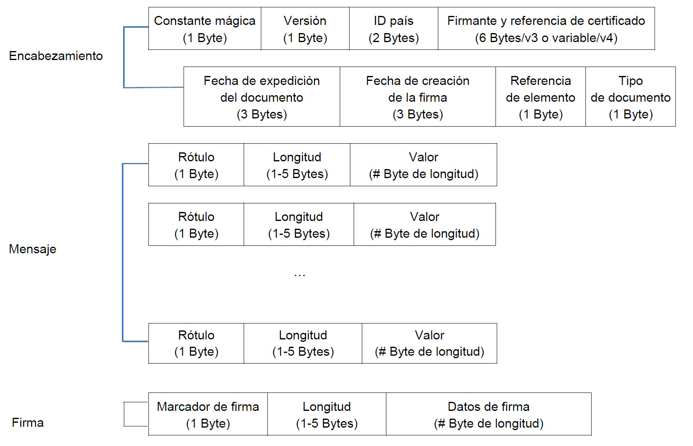

## Encabezamiento

La cabecera tiene la estructura definida en el documento [ICAO_9303-13]:

| Posición | Tamaño | Descripción |
| --- | --- | --- |
| 0x00 | 1 | ‘Magic Constant’. Siempre es el valor 0xDC |
| 0x01 | 1 | Versión del formato utilizado. Siempre será el valor 0x03, que indica que es la versión 4. Se utiliza esta versión por ser la más actual, y que permite datos de tamaño superior a 254 bytes. |
| 0x02 | 2 | País expedidor. Siempre tendrá el valor ‘ES’. |
| 0x04 | v | Identificador del firmante, y referencia del certificado. <br>Está formado: <br>Dos letras que identifican el país. <br>Dos caracteres que identifican la entidad firmante en el país. <br>Dos dígitos que indican el tamaño de la referencia del certificado. <br>Cadena hexadecimal que referencia el certificado de firma. <br>El Identificador del firmante (cuatro primeros caracteres) debe coincidir con el DN (Distinguished Name) del sujeto del certificado, y la referencia del certificado con el número de serie del certificado. |
| 0x04+v | 3 | Fecha de emisión del documento |
| 0x07+v | 3 | Fecha de firma de los datos |
| 0x0A+v | 1 | Referencia a la definición de los elementos del documento: <br>7: Verificación simple <br>8: Verificación completa <br>9: Verificación de edad |
| 0x0B+v | 1 | Categoría de tipo de documento:  	9: DNI en el móvil de España |


Los campos de texto incluidos es esta cabecera, utilizan la codificación C40 descrita en el documento [ICAO_9303-13].

Los dos campos de fecha incluidos en la cabecera utilizan la codificación definida en el apartado 2.3.1 del documento [ICAO_9303-13].

## Mensaje

A continuación, se definen los datos que compartiría la app móvil para su verificación por parte de otros dispositivos, de acuerdo a los tres perfiles de datos previstos:

Verificación Simple, incluyendo los datos básicos del DNI.

Verificación Completa, incluyendo datos adicionales.

Verificación de mayoría de edad, únicamente si el ciudadano es mayor de edad.

### Datos incluidos según el tipo de QR

En esta sección, se muestran todos los datos que pueden encontrarse en un QR generado por la aplicación miDNI, y se indica en qué tipo de QR está presente:

| Etiqueta | Descripción | Formato |  |  |  |
| --- | --- | --- | --- | --- | --- |
| 0x40 | Número de documento (nueve caracteres más significativos + letra de verificación) |  | X | X | X |
| 0x42 | Fecha de nacimiento | ‘DD-MM-YYYY’ |  | X | X |
| 0x44 | Nombre |  |  | X | X |
| 0x46 | Apellidos |  |  | X | X |
| 0x48 | Sexo | F / M |  | X | X |
| 0x4c | Fecha de caducidad del documento | ‘DD-MM-YYYY’ |  | X | X |
| 0x50 | Imagen en miniatura | Jpeg2000 | X | X | X |
| 0x60 | Dirección completa |  |  |  | X |
| 0x72 | Lugar de domicilio, línea 1 |  |  |  | X |
| 0x74 | Lugar de domicilio, línea 2 |  |  |  | X |
| 0x76 | Lugar de domicilio, línea 3 |  |  |  | X |
| 0x62 | Lugar de nacimiento, línea 1 |  |  |  | X |
| 0x78 | Lugar de nacimiento, línea 2 |  |  |  | X |
| 0x7a | Lugar de nacimiento, línea 3 |  |  |  | X |
| 0x64 | Nacionalidad |  |  |  | X |
| 0x66 | Nombre de padre y madre |  |  |  | X |
| 0x68 | Número de soporte del DNI físico |  |  |  | X |
| 0x70 | Si el ciudadano es mayor de Edad | Un byte 0x00/0x01 | X |  |  |
| 0x80 | Fecha/hora de caducidad de los datos | ‘DD-MM-YYYY hh:mm:ss’ | X | X | X |


## Ejemplo decodificación

## Imagen QR

A continuación, se muestra una imagen de ejemplo, que se va a decodificar.


## Datos del QR

Al leer este QR, los datos obtenidos serán:

> Volcado hex separado: `code/fixtures/qr_dump_01.txt`

### Cabecera

Los primeros 38 bytes constituyen la cabecera del sello definida en el documento de ICAO:

> Volcado hex separado: `code/fixtures/qr_dump_02.txt`

Que se interpretan de la siguiente forma:

| Valor | Tamaño | Descripción |
| --- | --- | --- |
| DC | 1 | ‘Magic Constant’. |
| 03 | 1 | Versión del formato utilizado. Siempre será el valor 0x03, que indica que es la versión 4. Se utiliza esta versión por ser la más actual, y que permite datos de tamaño superior a 254 bytes. |
| 7581 | 2 | País expedidor, codificado en C40. Siempre tendrá el valor ‘ES’. <br>C40decode(‘7581’) → “ES” |
| 759ea9b5 <br> <br>267c3411 <br>4bf91b66 2d5d785a 71f94bb4 <br>72ec71f9 <br>71c1 | v | Identificador del firmante, y referencia del certificado, en formato C40. <br> <br>Decodificando los 4 primeros bytes: <br>C40decode(‘759ea9b5’) → “ESPN20” <br> <br>El 20 final indica que la referencia del certificado tiene 32 (0x20) bytes, y para codificar 32 bytes en C40 se necesitan 22 bytes ((32+2)/3)*2 en aritmética entera. <br> <br>y decodificando los 22 siguiente bytes: <br>C40decode(‘267c...71c1’)→ “2274948240B9368F65E5C80FEBFE5CE4” <br> <br>Resultando: <br>Pais → ES. <br>Entidad firmante en el país → PN. <br>Tamaño de la referencia del certificado → .32 (0x20) bytes una vez decodificados C40, 22 bytes antes de decodificar <br>Referencia el certificado de firma → 2274948240B9368F65E5C80FEBFE5CE4. |
| 3fa8f8 | 3 | Fecha de emisión del documento: Wed Apr 17 00:00:00 GMT+02:00 2024 |
| 3fa8f8 | 3 | Fecha de firma de los datos: Wed Apr 17 00:00:00 GMT+02:00 2024 |
| 07 | 1 | Referencia a la definición de los elementos del documento:  <br>	 	7: Verificación simple |
| 09 | 1 | Categoría de tipo de documento:  	9: DNI en el móvil de España |


### Cuerpo del QR

El cuerpo del QR está formado por los campos en formato TLV de los datos incluidos en el

QR seleccionado.

En el volcado mostrado anteriormente, las etiquetas de los TLV se muestran en negrita, y las longitudes en negrita cursiva.

Los datos obtenidos en este ejemplo concreto son:

nDocumento         0x40 (  9) - 99999999R                    - 393939393939393952 fNacimiento        0x42 ( 10) - 01-01-1980                   - 30312D30312D31393830 Nombre             0x44 (  6) - CARMEN                       - 4341524D454E

Apellidos          0x46 ( 19) - ESPA..OLA ESPA..OLA          - 45535041C3...C3914F4C41 Sexo               0x48 (  1) - M                            - 4D

fCaducidad         0x4c ( 10) - 17-04-2034                   - 31372D30342D32303334 imagenMini         0x50 (892) - ....jP  .........._@...      - 0000000C6A...5F4080FFD9 Caducidad BiDi     0x80 ( 19) - 17-04-2024 11:28:20          - 31372D3034...32383A3230

Todas las fechas/horas están en UTC.

### Firma de datos

El último dato incluido es la firma de los datos, añadida como un TLV más con etiqueta 0xff:

SIGNATURE            255 ( 64) – 9881E4DA3427F7F8F0C4BB2E04514E46F97398AEF2734235BAAC261627609FC0

EC0F3B591D592AAE5B40D85749C8768EF9B183AA1CBF7561C1C0E22B423EB660

Para verificar la firma, lo primero es obtener el certificado utilizado para la firma, y que se puede identificar a partir de la referencia incluida en la cabecera del sello:

“2274948240B9368F65E5C80FEBFE5CE4”.

Cabe señalar que las firmas de miDNI tienen una validez limitada, al estar diseñadas para ser verificadas en el momento y caducar a los pocos minutos. La verificación de la firma y la caducidad de los datos de miDNI aseguran la autenticidad y validez de los datos únicamente en el momento de su verificación.

Los datos a firmar son todo el contenido del QR, excepto el TLV de la firma al final de los datos.

En el ejemplo, es todo el contenido desde la posición 0 a la posición 0x3fe, dónde empieza firma.

Datos a firmar  “dc03758175 … 313a32383a3230”

Por último, la firma es el contenido del último TLV, con etiqueta 0xff:

Firma  “9881E4DA3427F7F8F0C4BB2E04514E46F97398AEF2734235BAAC261627609FC0

EC0F3B591D592AAE5B40D85749C8768EF9B183AA1CBF7561C1C0E22B423EB660”

Con estos tres datos (certificado firmante, datos firmados, y firma), ya podemos verificar la firma.

En este ejemplo la firma está realizada con ECDSA, y en el sello solo se incluyen los dos componentes (r y s) de la firma, sin la estructura ASN1 que algunas librerías de verificación esperan como entrada.

El siguiente ejemplo en java muestra cómo realizar la verificación de este ejemplo, incluyendo la construcción del ASN1 que espera la librería de verificación:

public static void main(String[] args) {     try {

//

// Certificado de firma

```java
// 
        String signerPemCert = 
            "MIIIPDCCBiSgAwIBAgIQInSUgkC5No9l5cgP6/5c5DANBgkqhkiG9w0BAQsFADB0MQswCQYDVQQGEwJF"+ 
            "UzEoMCYGA1UECgwfRElSRUNDSU9OIEdFTkVSQUwgREUgTEEgUE9MSUNJQTEMMAoGA1UECwwDQ05QMRgw"+             "FgYDVQRhDA9WQVRFUy1TMjgxNjAxNUgxEzARBgNVBAMMCkFDIERHUCAwMDQwHhcNMjQwMzA0MTMwOTM1"+             "WhcNMjkwMzA0MTMwOTM1WjCBozELMAkGA1UEBhMCRVMxIDAeBgNVBAoTF01JTklTVEVSSU8gREVMIElO"+             "VEVSSU9SMRowGAYDVQQLExFTRUxMTyBFTEVDVFJPTklDTzEjMCEGA1UECxMaQ1VFUlBPIE5BQ0lPTkFM"+ 
            "IERFIFBPTElDSUExGDAWBgNVBGETD1ZBVEVTLVMyODE2MDE1SDEXMBUGA1UEAxMOQVBQRE5JTU9WSUxQ"+             "UkUwWTATBgcqhkjOPQIBBggqhkjOPQMBBwNCAARBfpojvXY9rbDS0VB2THZuTjX7Ii807tkKnAZZwbIO"+             "Et3FdGykeOHv9tt5PxPD/kr2io50wL1r2MGawBTo7wBpo4IEYzCCBF8wDAYDVR0TAQH/BAIwADAOBgNV"+             "HQ8BAf8EBAMCBeAwHQYDVR0OBBYEFFIE+56N46OfWO0z/Yw9z3GQmIcmMB8GA1UdIwQYMBaAFA2n5MC0"+ 
            "15fkdNyGfFL+9N4yYjK8MIG6BggrBgEFBQcBAwSBrTCBqjAIBgYEAI5GAQEwCwYGBACORgEDAgEPMAgG"+ 
            "BgQAjkYBBDATBgYEAI5GAQYwCQYHBACORgEGAjByBgYEAI5GAQUwaDAyFixodHRwczovL3BraS5wb2xp"+             "Y2lhLmVzL2NucC9wdWJsaWNhY2lvbmVzL3BkcxMCZW4wMhYsaHR0cHM6Ly9wa2kucG9saWNpYS5lcy9j"+ 
            "bnAvcHVibGljYWNpb25lcy9wZHMTAmVzMGkGCCsGAQUFBwEBBF0wWzAiBggrBgEFBQcwAYYWaHR0cDov"+             "L29jc3AucG9saWNpYS5lczA1BggrBgEFBQcwAoYpaHR0cDovL3BraS5wb2xpY2lhLmVzL2NucC9jZXJ0"+             "cy9BQzAwNC5jcnQwggEuBgNVHSAEggElMIIBITCCAQYGCGCFVAECAWY5MIH5MDcGCCsGAQUFBwIBFito"+             "dHRwOi8vcGtpLnBvbGljaWEuZXMvY25wL3B1YmxpY2FjaW9uZXMvZHBjMIG9BggrBgEFBQcCAjCBsAyB"+ 
            "rVFDQzogc2VsbG8gZWxlY3Ryw7NuaWNvIGRlIEFkbWluaXN0cmFjacOzbiwgw7NyZ2FubyBvIGVudGlk"+             "YWQgZGUgZGVyZWNobyBww7pibGljbywgbml2ZWwgYWx0by4gQ29uc3VsdGUgbGFzIGNvbmRpY2lvbmVz"+             "IGRlIHVzbyBlbiBodHRwOi8vcGtpLnBvbGljaWEuZXMvY25wL3B1YmxpY2FjaW9uZXMvZHBjMAkGBwQA"+ 
            "i+xAAQMwCgYIYIVUAQMFBgEwgbUGA1UdHwSBrTCBqjCBp6AqoCiGJmh0dHA6Ly9wa2kucG9saWNpYS5l"+             "cy9jbnAvY3Jscy9DUkwuY3JsonmkdzB1MQswCQYDVQQGEwJFUzEoMCYGA1UECgwfRElSRUNDSU9OIEdF"+             "TkVSQUwgREUgTEEgUE9MSUNJQTEMMAoGA1UECwwDQ05QMRgwFgYDVQRhDA9WQVRFUy1TMjgxNjAxNUgx"+             "FDASBgNVBAMMC0FSQyBER1AgMDAyMIHNBgNVHREEgcUwgcKBDnBraUBwb2xpY2lhLmVzpDIwMDEuMCwG"+ 
            "CWCFVAEDBQYBARYfU0VMTE8gRUxFQ1RST05JQ08gREUgTklWRUwgQUxUT6Q7MDkxNzA1BglghVQBAwUG"+ 
            "AQIWKEFNQklUTyBERUwgQ1VFUlBPIE5BQ0lPTkFMIERFIExBIFBPTElDSUGkHDAaMRgwFgYJYIVUAQMF"+ 
            "BgEDFglTMjgxNjAxNUikITAfMR0wGwYJYIVUAQMFBgEFFg5BUFBETklNT1ZJTFBSRTAdBgNVHSUEFjAU"+ 
            "BggrBgEFBQcDBAYIKwYBBQUHAwIwDQYJKoZIhvcNAQELBQADggIBADRybjPKB0n/vmbyRnnZ5FgYp1qt"+             "F/UaozwxcwgAGpcxIFxNC9iqohC6DrAC6pO9MUzdbzB3VnKam6/gYsNJmXAkPf/2SEuZJBTqP3HlrRet"+ 
            "PPJ+BsTRDueN4nA5MWj7GGpYIvjci15Iz1RONgOrZpG2wT6kTH07KM7dJ0e2q0+iU4JH3dj9eFcNd+cs"+ 
            "NjOrWFTS55gDU2Pxjul33r1d2Vi3ymBpQCzgxX7RczwgYcrmtiWFbwpqc/ZmIqrqt6jI2vV2cxRr4s4v"+ 
            "wKY3RQf2rRvhF/39o9YvYUyjxWaR9/DjhF+LdOBUSJhU0OyAjvOYTtYHThWjMWAKEUrUU4ilBgbFZTwS"+ 
            "aFXCSB7kMAImMt93tmhzAx0lBfYP4NRK/H8L4cr1mnvqNI2NFGWiYFlIcySKcyqGqNjn7zlgQdRotnW1"+ 
            "rqvhe0UyQuO98uVkSBN3Xzo6VGTgVBEVquwP1QT9lgv5+7LtaycjKpADmX3m4tdf/whnHCtKVUpWA+iq"+ 
            "Pwjytqef2VjzoQIWX2knt2uHMHRBmt6ktR5vKelv0ewEZloYCsT+2SPuo3rpd9EOJkLl02O9UG7T0lhw"+             "1UvFkJ5wMfjK8+gc/5x5hGe8Fzcg4culTrIBTTq2HhQ45wBHRYUXNNOHGyi0AqC0Vo5JnB6NjDXkMkQr"+ 
            "WGmckU12Ztc72pg0"; 
 
        X509Certificate signerX509cert = 
                (X509Certificate) CertificateFactory.getInstance("X.509"). 
                generateCertificate( 
                        new ByteArrayInputStream(Base64.getDecoder().decode(signerPemCert))                 ); 
 
        PublicKey signerPubkey = signerX509cert.getPublicKey();
```


```java
// 
        // Datos firmados 
        // 
        byte[] toBeSigned = HexFormat.of().parseHex( 
            "dc037581759ea9b5267c34114bf91b662d5d785a71f94bb472ec71f971c13fa8f83fa8f807094009"+             "393939393939393952420a30312d30312d3139383044064341524d454e461345535041c3914f4c41"+ 
            "2045535041c3914f4c4148014d4c0a31372d30342d323033345082037c0000000c6a5020200d0a87"+             "0a00000014667479706a703220000000006a7032200000002d6a7032680000001669686472000001"+             "ec000001900001070700000000000f636f6c72010000000000110000032f6a703263ff4fff510029"+             "000000000190000001ec000000000000000000000190000001ec00000000000000000001070101ff"+ 
            "52000c00000001000504040000ff5c002342772076f076f076c06f006f006ee06750675067685005"+ 
            "5005504757d357d35762ff640025000143726561746564206279204f70656e4a5045472076657273"+             "696f6e20322e352e30ff90000a00000000029e0001ff93cfae8e14001e5744c90b9fbe9967e5de2b"+ 
            "9341c32d0ae417bb06f61c49c5c20f9403a8ece87101552ffa6274f1a1ed6cfe3382bf80157c3de7"+             "8d3f52e23dfd1f1919a162d40e11b804be3c5af52bcbc76ffd114a7007fe79ddc169c02d073609ef"+             "80108f58d8b225567c8e431e3b9bb7fef7c9bea102fbba999584e469770fcc69a90f0dd3481b9cee"+             "70ef118e0c51ccc1c3e4a243e35b07c342571a601aaf804901fef7f5f3ae4c7dd6157aed21351148"+ 
            "755e9295e925b1b0e2f8d4588683667fe58e4ba9852f085db359b10c44a85971f5d1316b44d9e4f7"+             "6c642ca9242d234bbeda731d43b6047cd79f81c4b7f89783f6598c2595433268ccb85bcc21cb61a0"+             "acff83801d84efff3aea24c6d04137ab133e4230a72704db22ac0e436d0ba880bb4787fb2d7d9506"+ 
            "93dd88c3e2d410f874283ad0a3fcced48e65952da38815615678cd85a20d1937b5732f0c034f2cfc"+             "617fc68f1941de699580de950676879895c02854b8e508fcd6578b1f81d5aaa9ed8ef4d84a4a2bee"+             "51e786e9b09cc9b5f1a85974e31e8f824993f58680263a918dd3870af4db2c5ce88f22442fcc989f"+             "adc02ff65e48151bfed898ab1b2e00e759aa1844db9ce98d97904deca6ea7319fb3d3839926cadba"+ 
            "789fb46d2d937077778485e68ea1b71a9e191675d60cd0dbd57d5a79e79edea17fb08bdecf01c982"+ 
            "6d6131b3b0d0c7d1f82f44d39c4ba502495d801ce79707d1bfb682dc644b1d4ff898d0e990de8bc6"+ 
            "4f6d5b36276ea8889f4c4ef61e2779af965d331f2c248fbac3ba1438a0ebc176bad055fa2159eea1"+ 
            "e06fa575ef1135f69b6e12d788fe2079cf388262281f70ce90362a3f7942a00e1a437f61072e1a6d"+             "7f3fa5f51a454e9cc8ebecf0928741cb609956cd8c5059079db1ca00e6a6a70dfbc907805f4080ff"+ 
            "d9801331372d30342d323032342031313a32383a3230");  
        // 
        // Firma         // 
        byte[] signature = HexFormat.of().parseHex( 
            "9881E4DA3427F7F8F0C4BB2E04514E46F97398AEF2734235BAAC261627609FC0" +             "EC0F3B591D592AAE5B40D85749C8768EF9B183AA1CBF7561C1C0E22B423EB660"); 
  
        if( signerPubkey instanceof java.security.interfaces.ECPublicKey ) {             // 
            // Verificación de firma 
            // 
            Signature ecdsaVerify = Signature.getInstance("SHA256withECDSA");             ecdsaVerify.initVerify(signerPubkey);
ecdsaVerify.update(toBeSigned); 
 
            ASN1EncodableVector v = new ASN1EncodableVector(); 
            BigInteger r = new BigInteger(1,  
                    Arrays.copyOfRange(signature, 0, signature.length / 2)                 ); 
            BigInteger s = new BigInteger(1,  
                    Arrays.copyOfRange(signature, signature.length / 2, signature.length) 
                ); 
            v.add(new ASN1Integer(r)); 
            v.add(new ASN1Integer(s)); 
            DERSequence seq = new DERSequence(v); 
 
            boolean verified = ecdsaVerify.verify(seq.getEncoded());             if( verified ) { 
                System.out.println("Firma correcta"); 
            }             else { 
                System.out.println("Firma incorrecta"); 
            }         }         else { 
            System.out.println("Clave de firma incorrecta"); 
        } 
 
 
    } catch (CertificateException | IOException | SignatureException |              NoSuchAlgorithmException | InvalidKeyException e) {         throw new RuntimeException(e); 
    } 
}
```


## Ejemplos de QRs

A continuación, se incluyen diversos QRs que pretenden ejemplificar las diversas situaciones que se podrá encontrar un dispositivo verificador.

Válidos con una caducidad extendida hasta 2030.

Caducados.

Con datos modificados, sin modificar la firma original.

Con datos modificados firmados correctamente por un certificado distinto al original.

Los ejemplos de QRs válidos se han generado de manera que su caducidad sea mucho mayor que los reales, de manera que se puedan utilizar como ejemplo durante el periodo indicado. Asimismo, la firma de los datos es correcta y se ha realizado con un certificado de pruebas (APPDNIMOVIL_pruebas.cer) que está publicado en el repositorio:

https://pki.policia.es/cnp/MiDNI

La referencia a este certificado se encuentra en la cabecera del QR.

Los QRs con datos caducados se han firmado de manera correcta con el mismo certificado firmante de pruebas. La única diferencia con los anteriores es que la fecha / hora de caducidad de los datos tiene un valor anterior a la fecha de publicación de este documento, por lo que no sería válido.

En el caso de los QRs con datos modificados sin modificar la firma original, se ha partido de un QR válido y se ha modificado el valor de un dato contenido en el QR. Al calcular la firma de los datos contenidos QR se evidenciará que es distinta a la incluida en el mismo y por lo tanto serían incorrectos.

Por último, se han generado QRs con datos válidos y firmados correctamente por un certificado distinto al de pruebas (APPDNIMOVIL_pruebas.cer), publicado en el repositorio:

https://pki.policia.es/cnp/MiDNI

Documento:    Verificación y formato de QR 	Versión: 	1.0.7

Categoría:      Documentación Confidencial 	Fecha: 	20/06/2025

En este caso, aunque el cálculo de la firma de los datos coincida con la firma incluida en el QR, se deberá dar por incorrecta por no estar calculada con el certificado publicado en el repositorio oficial.

## Válidos con caducidad extendida hasta 2030

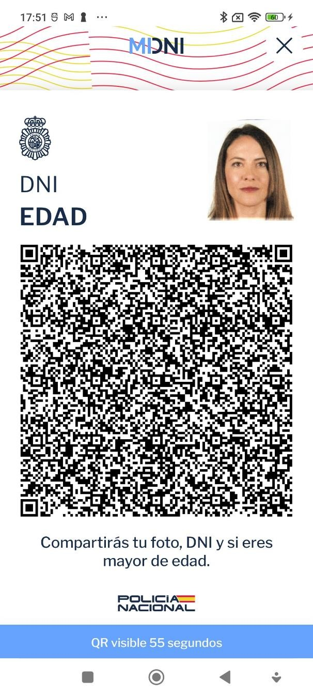


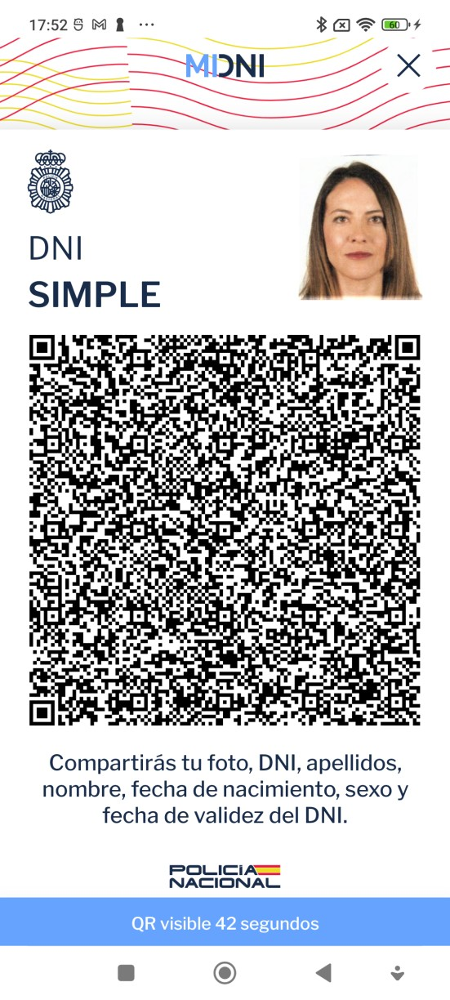

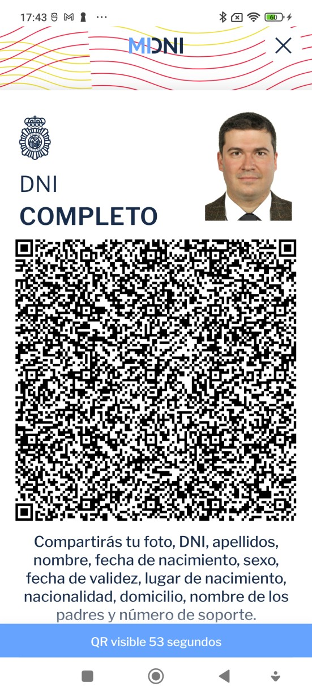

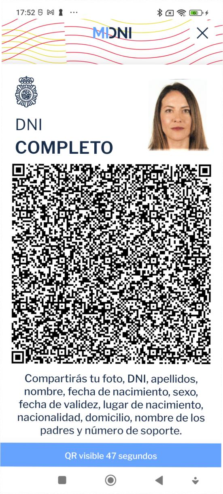

## Caducados

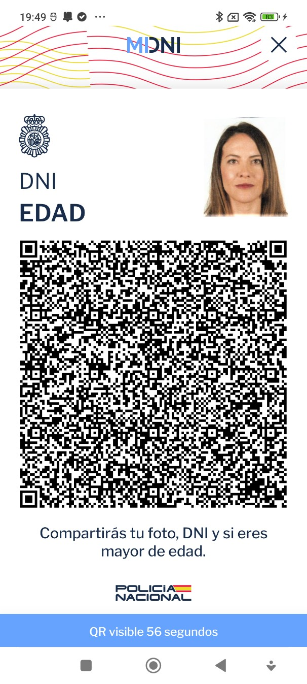

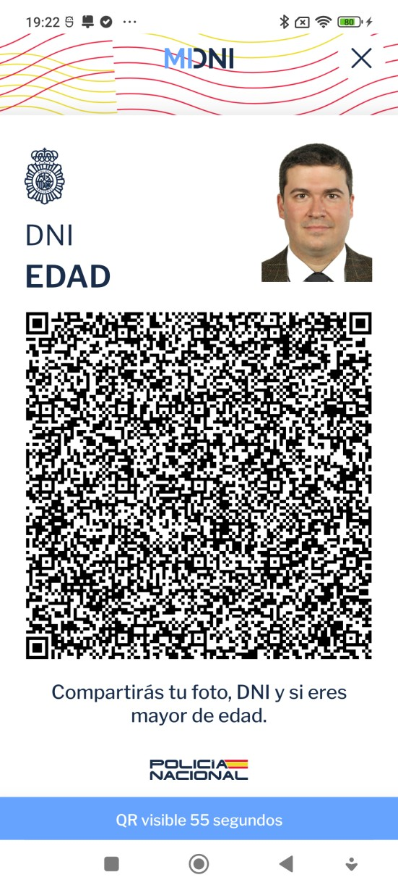

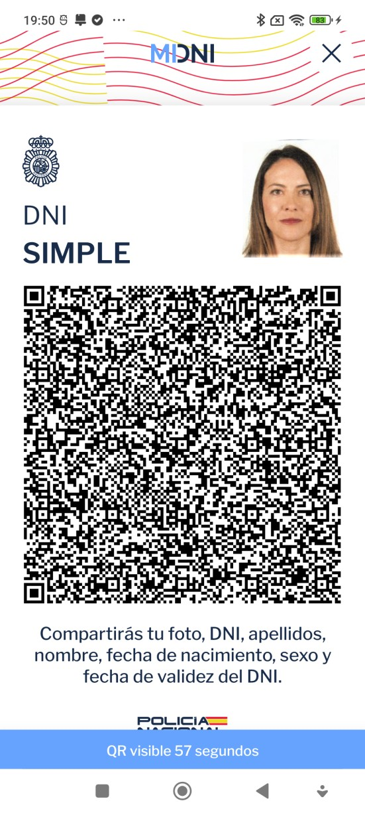

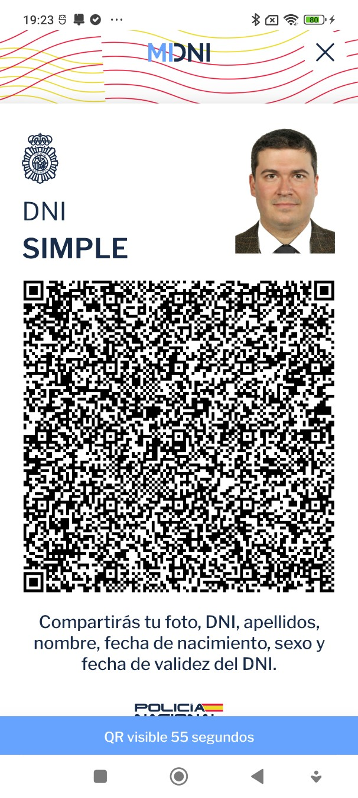


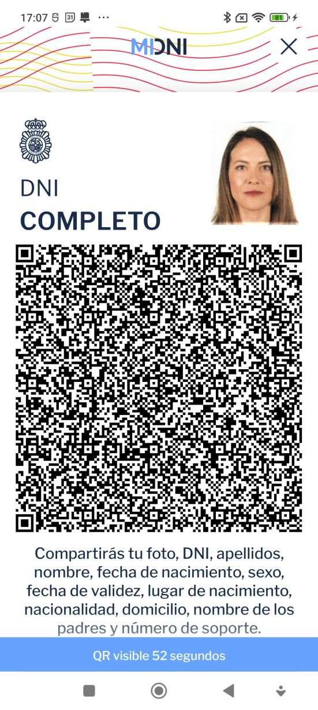

## Con datos modificados, sin modificar la firma original

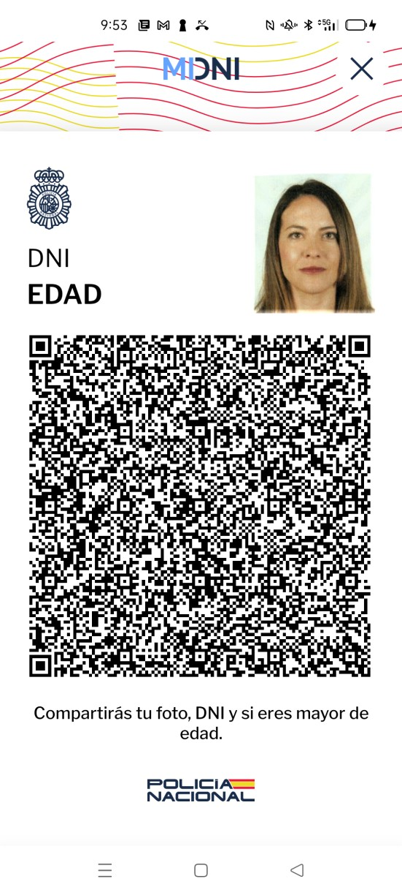

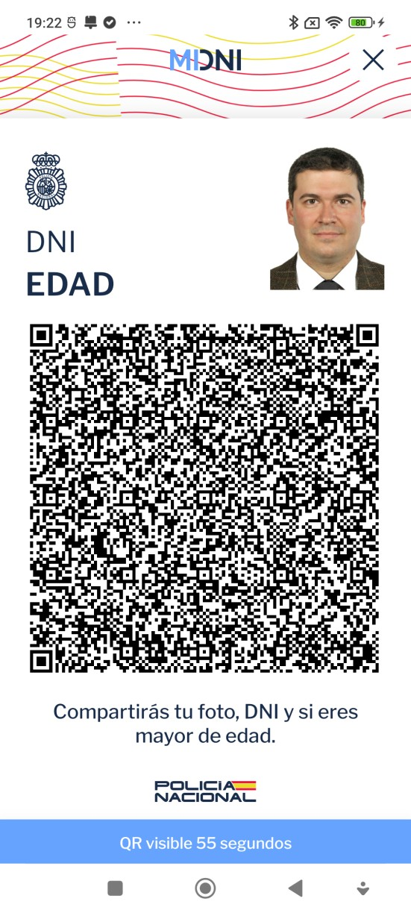

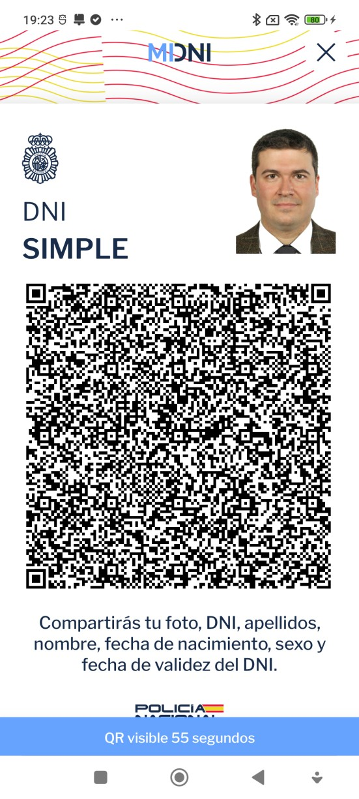

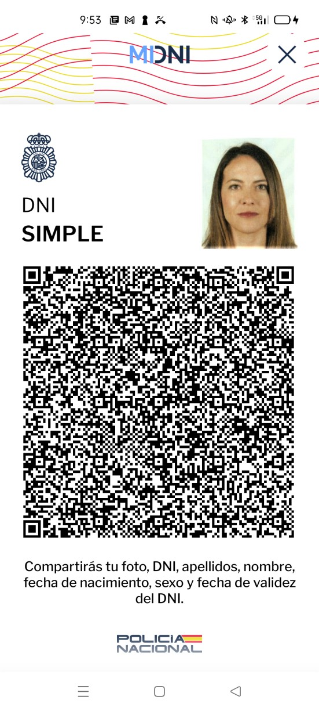

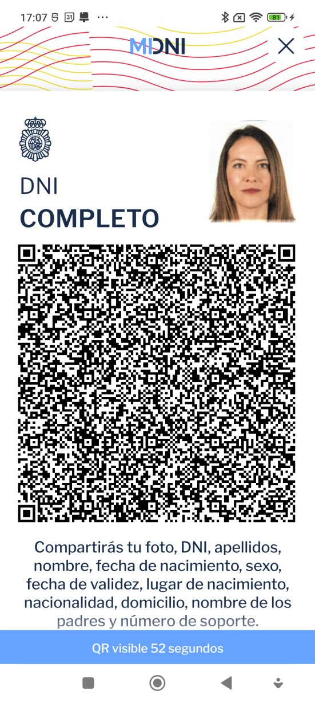

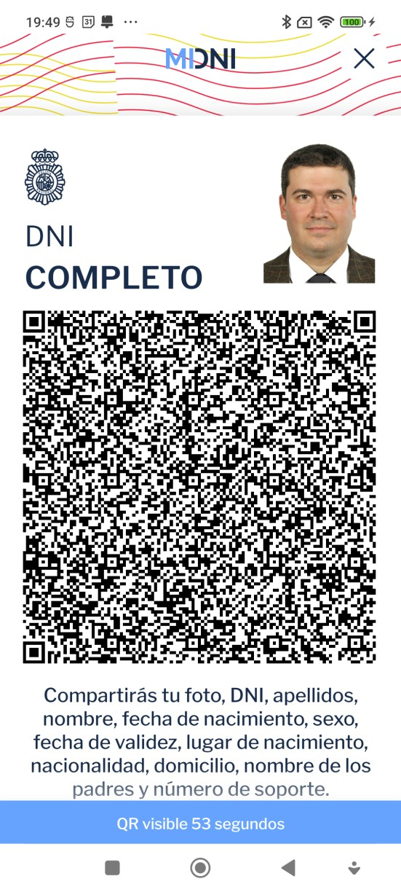

## Con datos modificados firmados por un certificado distinto al original

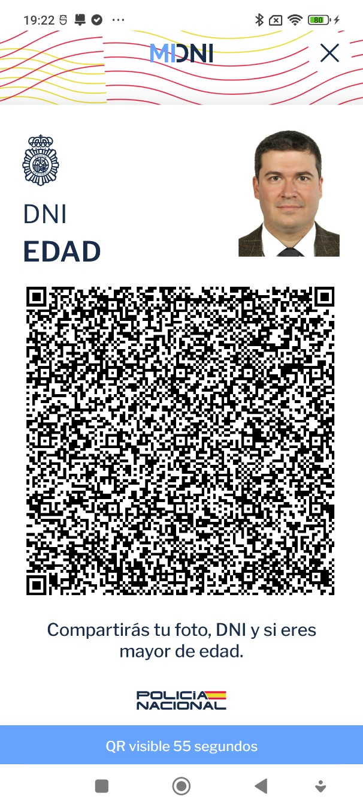

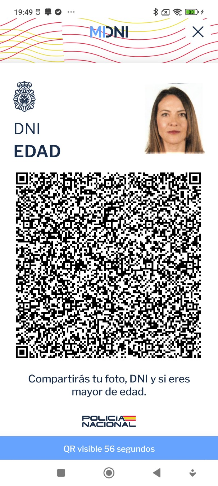

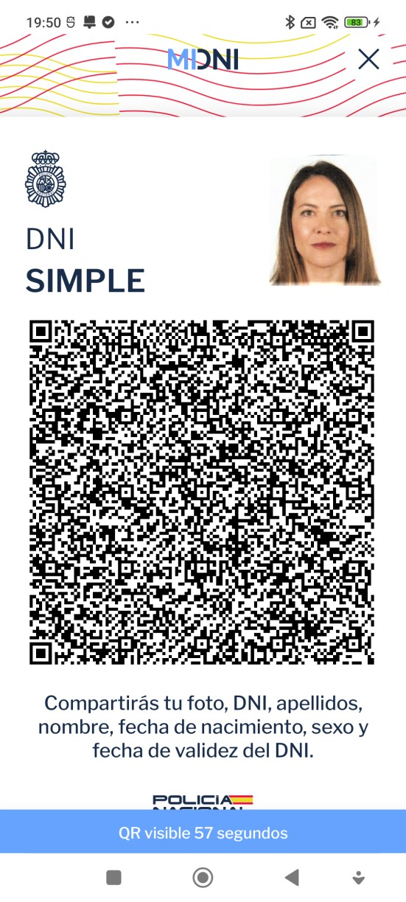

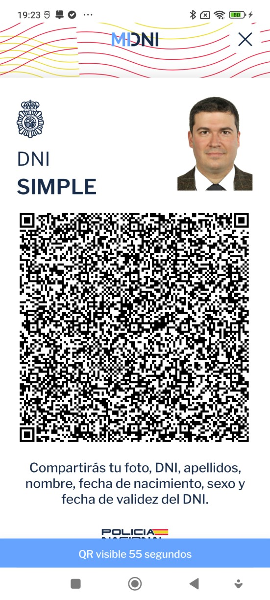

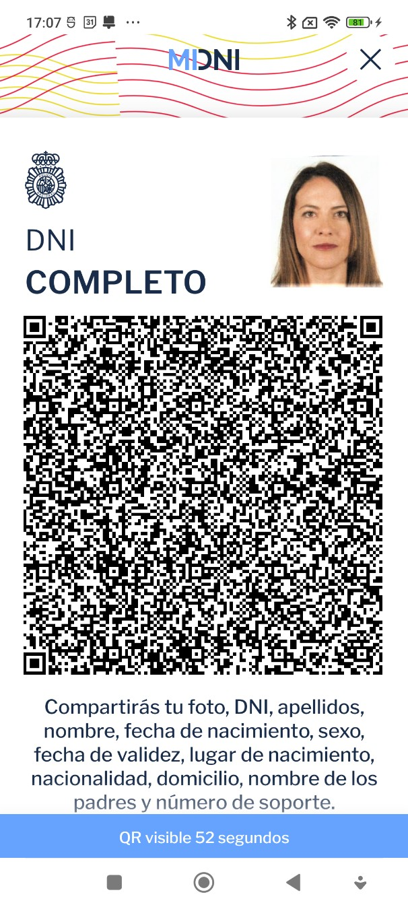

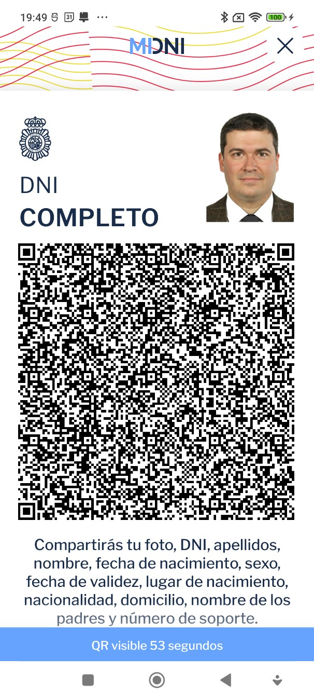

Documento:    Verificación y formato de QR 	Versión: 	1.0.7

Categoría:      Documentación Confidencial 	Fecha: 	20/06/2025

## Referencias

[ICAO_9303-13] Parte 13: Sellos digitales visibles. https://www.icao.int/publications/Documents/9303_p13_cons_es.pdf https://www.icao.int/publications/Documents/9303_p13_cons_en.pdf
